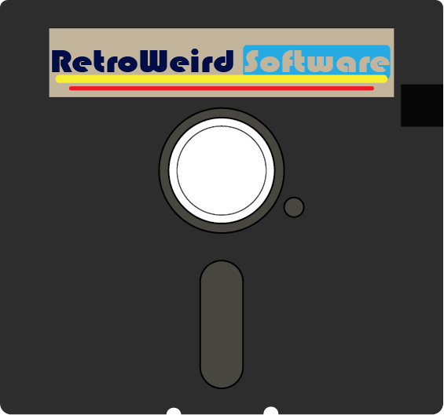

# Previous Work

#### **These are some of the work ive done so far during college at Mizzou.**

### Adobe Illustrator

<p float="left">
  
   
</p>

<p float="left">
  
   
</p>

### Adobe Photoshop
<p float="left">
  
</p>


### HTML
```html
<!DOCTYPE html>
<html>
   <head>
       <meta charset="UTF-8">
       <title>Fizz Buzz</title>

       <script>
           function fizzbuzz() {
           var display = document.getElementById('display');
           var displayHTML = "";
           for (i = 0; i < 100; i++) {
           displayHTML += "<p>" + i + "</p>";
           }
           display.innerHTML = displayHTML;
           }
       </script>
   </head>
   <body onload="fizzbuzz()">
       <div id="display">
       </div>
   </body>
</html>
```

### C# Code

```c#
using System;
using System.IO;

namespace Wilkerson_DocumentMerger
{
    class Program
    {
        static void Main(string[] args)
        {   
            bool doAgain = true;
            string moreMerging;
            while(doAgain){
                Console.WriteLine("Document Merger\n");
                //set up file 1 and content for file 1.
                string fileName1 = getUserFileName();;
                string path1 = createFilePath(fileName1);
                string docContent1 = documentContent(path1);
                if(!File.Exists(path1)){
                    File.WriteAllText(path1, docContent1);
                }
                //set up file 2 and content for file 2.
                string fileName2 = getUserFileName();
                string path2 = createFilePath(fileName2);
                string docContent2 = documentContent(path2);
                if(!File.Exists(path2)){
                    File.WriteAllText(path2, docContent2);
                }

                //create new merged file name.
                string mergedFileName = mergeFileNames(fileName1, fileName2);
                //create new merged text string.
                string mergedContent = mergeContent(docContent1, docContent2);
                //create path for new merged documents.
                string mergedPath = createFilePath(mergedFileName);
                if(!File.Exists(mergedPath)){
                    File.WriteAllText(mergedPath, mergedContent);
                }
                Console.WriteLine($"{mergedFileName} was successfully saved. The document contains {mergedContent.Length} characters");
                Console.WriteLine("Would you like to convert more grades (y/n)?");
                moreMerging = Console.ReadLine();                                                                                      
                if (moreMerging != "y" && moreMerging != "Y"){
                    doAgain = false;
                }
            }
        }
        //function to get file name, add .txt if needed.
        static string getUserFileName(){
            try{
                Console.WriteLine("Please enter name of the file: ");
                string fileName = Console.ReadLine();
                //add .txt to file name if needed.
                fileName = checkUserFileName(fileName);
                string path = Environment.CurrentDirectory + "/" + fileName;
                if(!File.Exists(path)){
                    Console.WriteLine("File does not exist. Please re-enter file name to create a new document.");
                    fileName = Console.ReadLine();
                    fileName = checkUserFileName(fileName);
                }
                return fileName;
            }catch(Exception e){
                Console.WriteLine(e);
                return null;
            }
        }
        //function to add .txt to file name
        static string checkUserFileName(string fileName){
            if(fileName.EndsWith(".txt")){
                return fileName;
            }else{
                fileName = fileName + ".txt";
                return fileName;
            }
        }
        //function to delete the .txt in the file name
        static string deleteTxt(string fileName){
            if(fileName.EndsWith(".txt")){
                fileName = fileName.Substring(0, fileName.Length-4);
                return fileName;
            }else{
                return fileName;
            }
        }
        //function to create a path
        static string createFilePath(string fileName){
            string path = Environment.CurrentDirectory + "/" + fileName;
            return path;
        }
        //function to create a string for the contents of a document.
        static string documentContent(string path){
            //create a new string for content if file doesnt exist
            if(!File.Exists(path)){
                Console.WriteLine("Type content to be put in document.");
                string docContent = Console.ReadLine();
                return docContent;
            //import existing content if file already exists
            }else{
                string docContent = System.IO.File.ReadAllText(path);
                return docContent;
            }
        }
        //function to merge file names.
        static string mergeFileNames(string fileName1, string fileName2){
            //delete .txt from file name 1.
            string noTxt1 = deleteTxt(fileName1);
            //create merged file name.
            string mergedFileName = noTxt1 + "_" + fileName2;
            return mergedFileName;
        }
        //function to merge content.
        static string mergeContent(string docContent1, string docContent2){
            string mergedContent = docContent1 + "\n\n\n" + docContent2;
            return mergedContent;
        }
    }
}

```
###### *Also See:*
* [Skills](./skills.md)
* [Accomplishments](./accomplishments.md)
* [Hobbies](./hobby.md)

[return to home page](./README.md)
