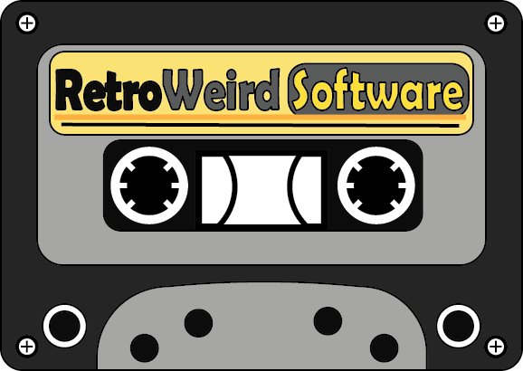

# Previous Work

#### **These are some of the work ive done so far during college at Mizzou.**

### Adobe Illustrator

<p float="left">
  
   
</p>

<p float="left">
  
   
</p>

### Adobe Photoshop
<p float="left">
  
</p>


### HTML
```html
<!DOCTYPE html>
<html>
   <head>
       <meta charset="UTF-8">
       <title>Fizz Buzz</title>

       <script>
           function fizzbuzz() {
           var display = document.getElementById('display');
           var displayHTML = "";
           for (i = 0; i < 100; i++) {
           displayHTML += "<p>" + i + "</p>";
           }
           display.innerHTML = displayHTML;
           }
       </script>
   </head>
   <body onload="fizzbuzz()">
       <div id="display">
       </div>
   </body>
</html>
```

### C code

```c
#include <stdio.h>
int main() {
// printf() displays the string inside quotation
printf("Hello, World!");
return 0;
}
```

###### *Also See:*
* [Skills](./skills.md)
* [Accomplishments](./marks.md)
* [Hobbies](./hobby.md)

[return to home page](./README.md)
